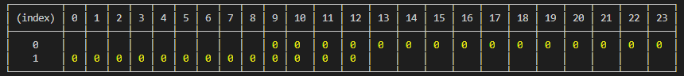
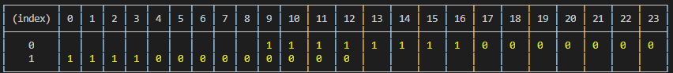

# Algoritmo Scheduling Jobs

Algoritmo para agendar jobs a serem executados respeitando os criteiros da janela em aberto.

### Tecnologia

  - Nodejs

### Dependencias 

  - Moment
  - Jest

#### `Moment:` Utilizado para manipular datas e horas im javascript.
#### `Jest:` Framework para auxiliar nos teste unitários.


##  Instalação Depedencias

```
npm install 
```


# Executando o código(massa default)

```
  npm run start
```

- Executando os teste


```
  npm run test
```


## Lógica

Criado uma matriz multidimensional sendo [dias][horas] representando o periodo da janela em aberto.

As horas disponiveis para agendamentos são marcados com o vlaor  `0` 




Quando ocorre o agendamento as horas utilizadas para conclusão do job são marcados com o valor `1`.



# Premissas

Para ocorrer um agendamento temos algumas premissas sendo:
  - Array com execução no máximo 8 horas 
  - Deve respeitar a data máxima de conclusão (Data e horário)

